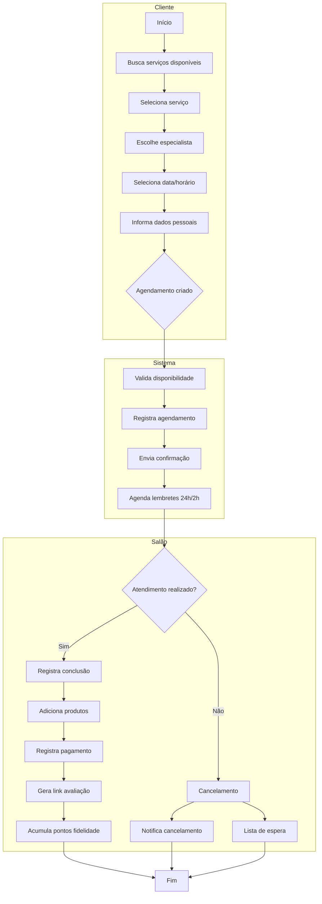
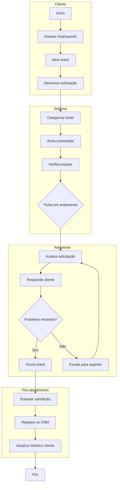
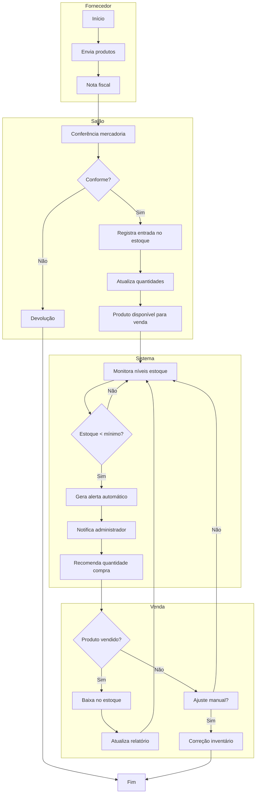
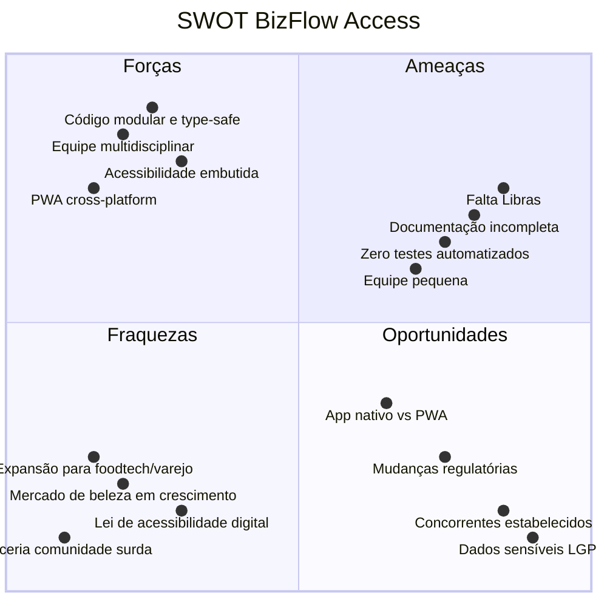

# Diagramas BPMN - BizFlow Access

## Processo 1: Fluxo de Vendas (Agendamento → Pagamento)

## Processo 2: Fluxo de Atendimento ao Cliente (Ticket → Resolução)

## Processo 3: Fluxo de Controle de Estoque (Entrada → Alerta → Reposição)

## Matriz SWOT

