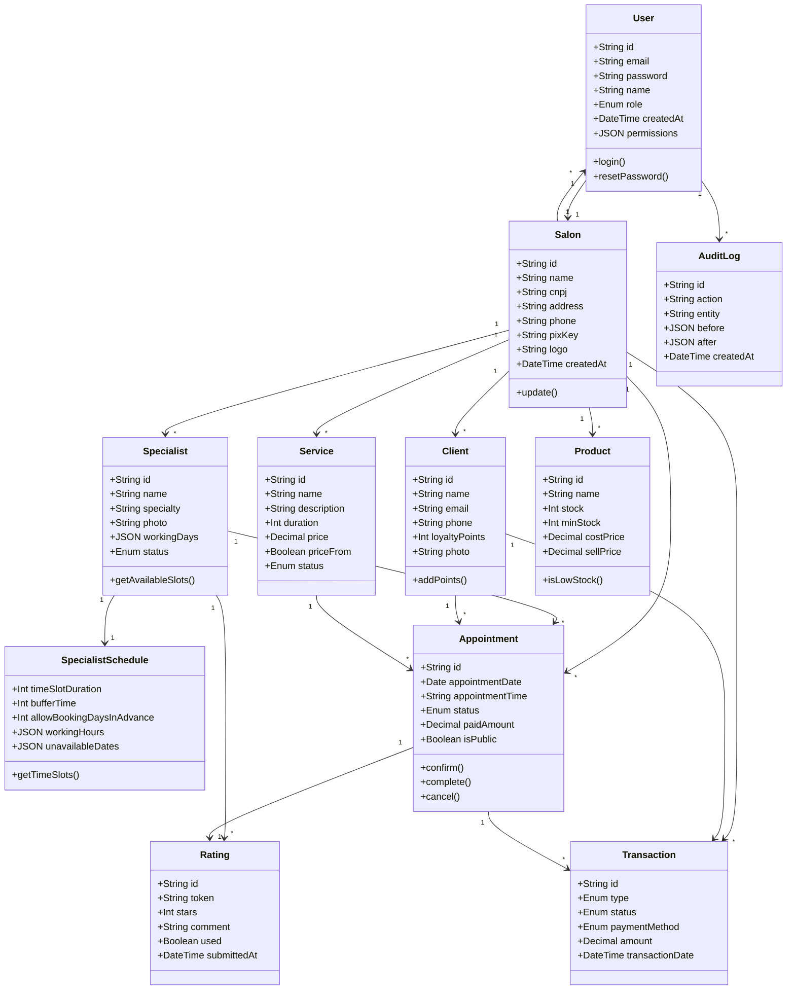
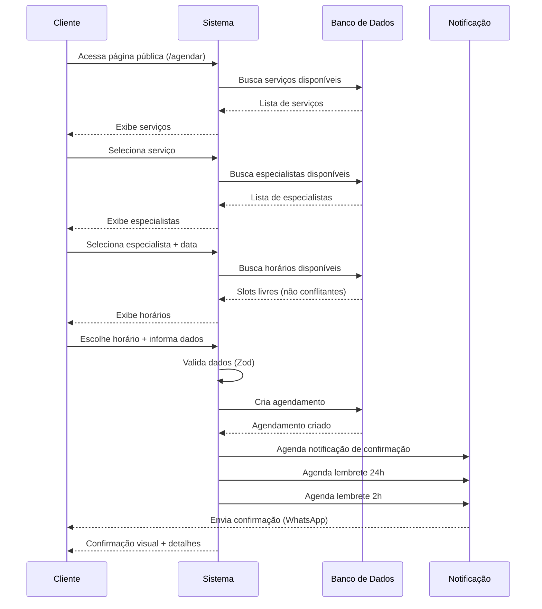
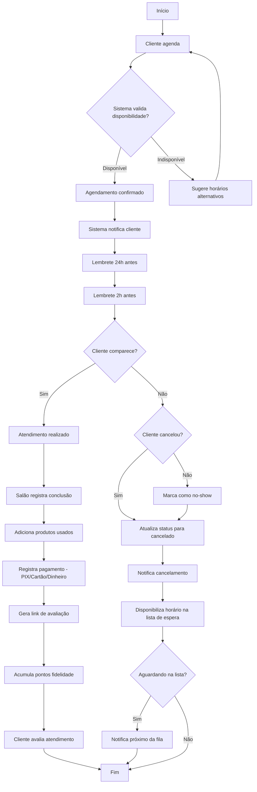
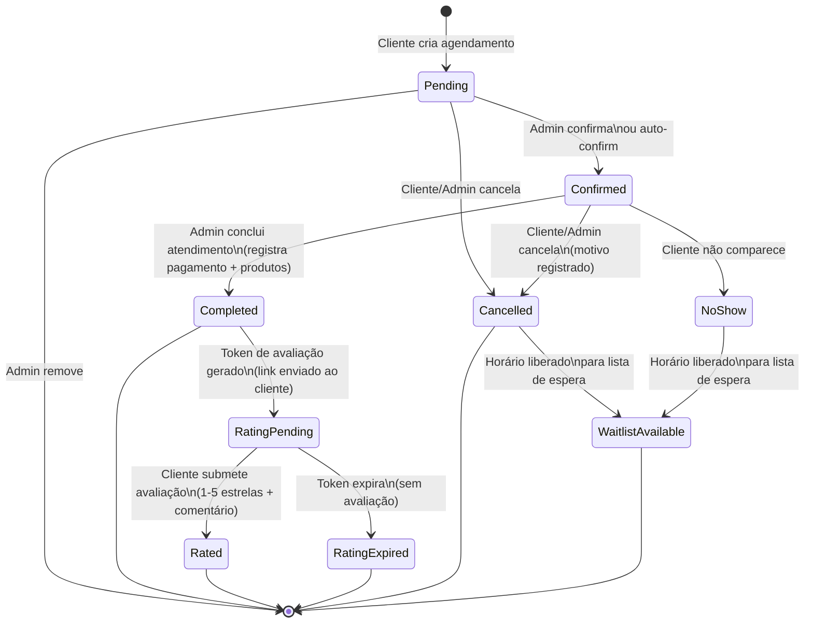
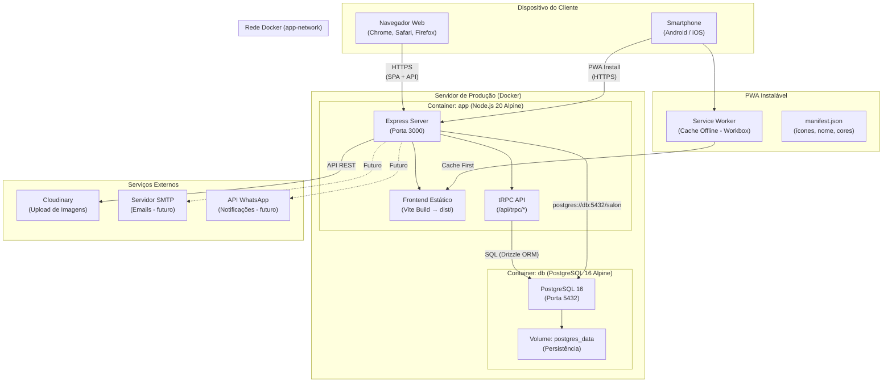
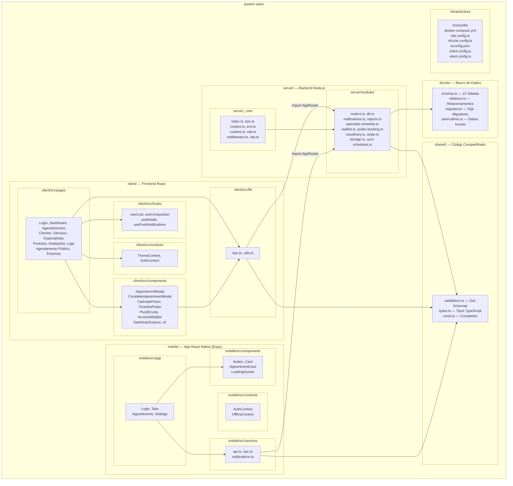

# Diagramas UML - BizFlow Access

## 1. Diagrama de Casos de Uso

```mermaid
graph TB
    subgraph "Sistema BizFlow Access"
        UC1[Fazer Login]
        UC2[Gerenciar Clientes]
        UC3[Gerenciar Serviços]
        UC4[Gerenciar Agendamentos]
        UC5[Gerenciar Produtos]
        UC6[Gerenciar Especialistas]
        UC7[Visualizar Dashboard]
        UC8[Emitir Relatórios]
        UC9[Gerenciar Empresa]
        UC10[Gerenciar Usuários]
        UC11[Agendar via Público]
        UC12[Avaliar Atendimento]
        UC13[Ver Ajuda Libras]
        UC14[Gerenciar Estoque]
    end

    subgraph "Atores"
        A1[Administrador]
        A2[Usuário Comum]
        A3[Cliente Externo]
    end

    A1 --> UC1
    A1 --> UC2
    A1 --> UC3
    A1 --> UC4
    A1 --> UC5
    A1 --> UC6
    A1 --> UC7
    A1 --> UC8
    A1 --> UC9
    A1 --> UC10
    A1 --> UC14

    A2 --> UC1
    A2 --> UC2
    A2 --> UC3
    A2 --> UC4
    A2 --> UC5
    A2 --> UC6
    A2 --> UC7
    A2 --> UC13

    A3 --> UC11
    A3 --> UC12
```

## 2. Diagrama de Classes

## 3. Diagrama de Sequência - Fluxo de Agendamento

## 4. Diagrama de Atividades - Ciclo do Atendimento

## 5. Diagrama de Estados — Ciclo de Vida do Agendamento

## 6. Diagrama de Componentes

```mermaid
graph TB
    subgraph "Frontend — React SPA (client/)"
        direction TB
        subgraph "Páginas (pages/)"
            P1[Login]
            P2[Dashboard]
            P3[Agendamentos]
            P4[Clientes]
            P5[Serviços]
            P6[Especialistas]
            P7[Produtos]
            P8[Agendamento Público]
            P9[Avaliação]
            P10[Empresa/Usuários/Logs]
        end

        subgraph "Componentes de Negócio (components/)"
            C1[AppointmentModal]
            C2[CompleteAppointmentModal]
            C3[CalendarPicker]
            C4[TimeSlotPicker]
            C5[DashboardLayout]
            C6[PixQRCode]
            C7[AccessibilityBar]
            C8[SpecialistScheduleManagement]
        end

        subgraph "Infraestrutura Frontend"
            F1[tRPC Client]
            F2[React Query Cache]
            F3[Auth Context]
            F4[Theme Context]
            F5[Service Worker PWA]
        end

        P1 --> F3
        P2 --> C5
        P3 --> C1
        P3 --> C2
        C1 --> C3
        C1 --> C4
        C2 --> C6
        P8 --> C4
        P1 --> F1
        P2 --> F1
        P3 --> F1
        F1 --> F2
    end

    subgraph "Backend — Node.js + Express (server/)"
        direction TB
        subgraph "Camada de API (_core/)"
            B1[Express Server]
            B2[tRPC Router]
            B3[Auth Middleware]
            B4[Rate Limiter + Helmet]
        end

        subgraph "Módulos de Negócio"
            M1[routers.ts — Procedures tRPC]
            M2[db.ts — Acesso ao Banco]
            M3[notifications.ts — Templates]
            M4[reports.ts — Relatórios CSV]
            M5[specialist-schedule.ts]
            M6[waitlist.ts — Lista de Espera]
            M7[public-booking.ts]
            M8[cloudinary.ts — Upload]
            M9[stripe.ts — Pagamentos]
        end

        B1 --> B4
        B4 --> B2
        B2 --> B3
        B2 --> M1
        M1 --> M2
        M1 --> M3
        M1 --> M4
        M1 --> M5
        M1 --> M6
        M1 --> M7
        M1 --> M8
    end

    subgraph "Camada Compartilhada (shared/)"
        S1[validations.ts — Zod Schemas]
        S2[types.ts — Tipos TypeScript]
        S3[const.ts — Constantes]
    end

    subgraph "Banco de Dados (drizzle/)"
        D1[schema.ts — Tabelas]
        D2[relations.ts — Relacionamentos]
        D3[migrations/ — SQL Migrations]
        D4[seed-admin.ts — Dados Iniciais]
    end

    F1 -->|HTTP POST /api/trpc| B2
    M2 -->|SQL via Drizzle ORM| DB[(PostgreSQL 16)]
    D1 --> M2
    S1 --> M1
    S1 --> F1
```

## 7. Diagrama de Implantação (Deployment)

## 8. Diagrama de Pacotes

