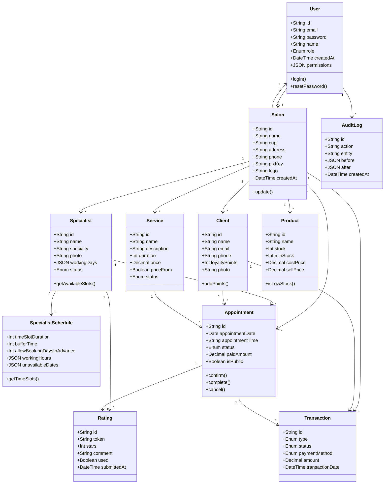
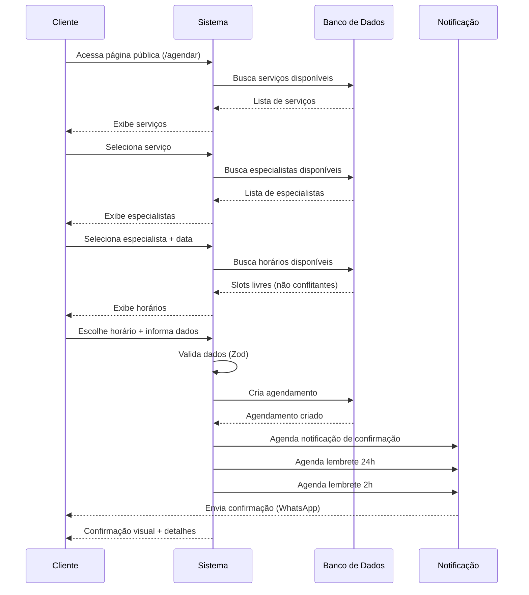
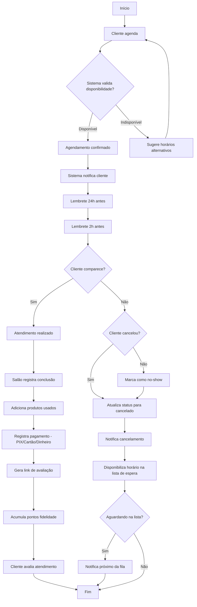

# Diagramas UML - BizFlow Access

## 1. Diagrama de Casos de Uso

```mermaid
graph TB
    subgraph "Sistema BizFlow Access"
        UC1[Fazer Login]
        UC2[Gerenciar Clientes]
        UC3[Gerenciar Serviços]
        UC4[Gerenciar Agendamentos]
        UC5[Gerenciar Produtos]
        UC6[Gerenciar Especialistas]
        UC7[Visualizar Dashboard]
        UC8[Emitir Relatórios]
        UC9[Gerenciar Empresa]
        UC10[Gerenciar Usuários]
        UC11[Agendar via Público]
        UC12[Avaliar Atendimento]
        UC13[Ver Ajuda Libras]
        UC14[Gerenciar Estoque]
    end

    subgraph "Atores"
        A1[Administrador]
        A2[Usuário Comum]
        A3[Cliente Externo]
    end

    A1 --> UC1
    A1 --> UC2
    A1 --> UC3
    A1 --> UC4
    A1 --> UC5
    A1 --> UC6
    A1 --> UC7
    A1 --> UC8
    A1 --> UC9
    A1 --> UC10
    A1 --> UC14

    A2 --> UC1
    A2 --> UC2
    A2 --> UC3
    A2 --> UC4
    A2 --> UC5
    A2 --> UC6
    A2 --> UC7
    A2 --> UC13

    A3 --> UC11
    A3 --> UC12
```

## 2. Diagrama de Classes

## 3. Diagrama de Sequência - Fluxo de Agendamento

## 4. Diagrama de Atividades - Ciclo do Atendimento

